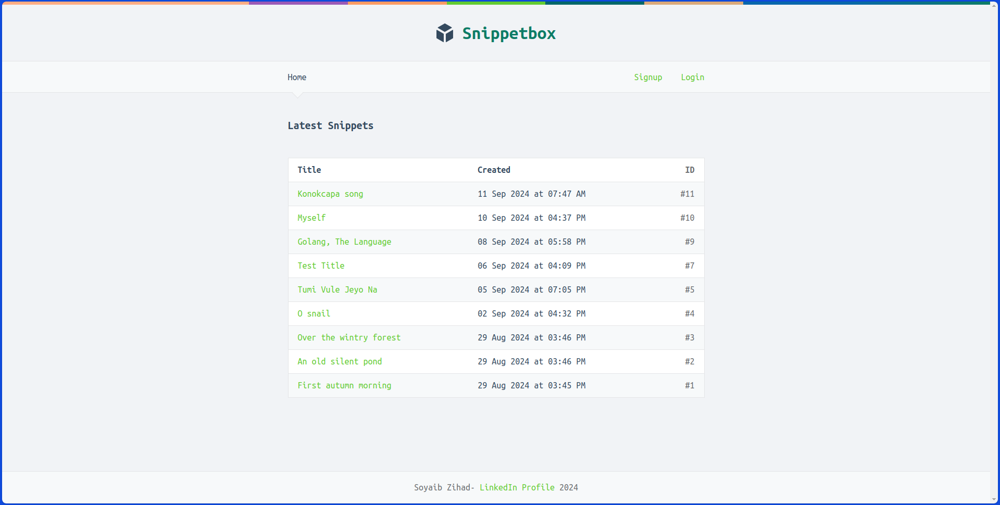

# **Snippetbox** - Effortlessly craft your snippet in a flash

This is a web application similar to Ubuntu Pastebin or GitHub Gist, designed for users to create and save text snippets. Registered users can create their own snippets, set an expiration time for each snippet, and view saved snippets.

---

## **Key Features**

### For Users:
- **Create Account/Login**: Users can create an account or log in to access their snippets.
- **Create Snippets**: Users can create and save their snippets.
- **Set Lifetime**: Each snippet can have an expiration time set by the user.
- **View Snippets**: Users can view their created snippets.

---

## **Tech Stack**

### Frontend:
- HTML, CSS, Bootstrap, JavaScript

### Backend:
- Go (Golang)

### Database:
- MySQL

### Packages:
- Pat Router
- Alice Middleware Manager
- Golangcollege Session Manager
- Justin NoSurf Package for CSRF Protection

---

## **Limitations**
- Features such as search or tagging are implemented yet. But I am working on it.

---

## **Demonstration**

#### 1. Homepage

The homepage provides an overview of the application and options to log in or register. Unregistered users can only see the snipeets but to create a snippet and save it users have to register to create an account or to login if already have an account.

#### 2. Registration Page
 

Users can register by filling in the registration form. If more then one users enter same email then error showing user already exists.

#### 3. Login Page

Users can log in to create their snippets.

#### 4. Create Snippet

Users can create and save new snippets along with the setting of expiration time.

#### 5. See Snippet

Users can view their saved snippets.

---
